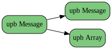
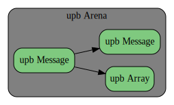
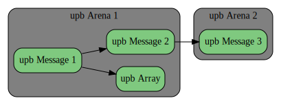
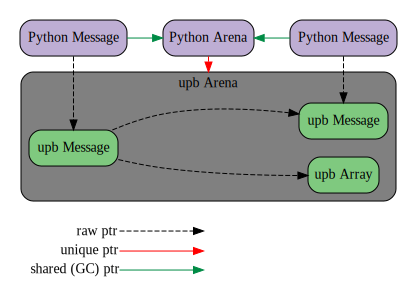

<!---
This document contains embedded graphviz diagrams inside ```dot blocks.

To convert it to rendered form using render.py:
  $ ./render.py wrapping-upb.in.md

You can also live-preview this document with all diagrams using Markdown Preview Enhanced
in Visual Studio Code:
  https://marketplace.visualstudio.com/items?itemName=shd101wyy.markdown-preview-enhanced
--->

# Wrapping upb in other languages

upb is a C kernel that is designed to be wrapped in other languages.  This is a
guide for creating a new protobuf implementation based on upb.

## What you will need

There are certain things that the language runtime must provide in order to be
wrapped by upb.

1. **Finalizers, Destructors, or Cleaners**: This is one unavoidable
   requirement: the language *must* provide finalizers or destructors of some sort.
   There must be a way of calling a C function when the language GCs or otherwise
   destroys an object.  We don't care much whether it is a finalizer, a destructor,
   or a cleaner, as long as it gets called eventually when the object is destroyed.
   Without finalizers, we would have no way of cleaning up upb data and everything
   would leak.
2. **HashMap with weak values**: This is not an absolute requirement, but in
   languages with automatic memory management, we generally end up wanting a
   hash map with weak values to act as a `upb_msg* -> wrapper` object cache.
   We want the values to be weak (not the keys).

## Reflection vs. Direct Access

Each language wrapping upb gets to decide whether it will access messages
through *reflection* or through *direct access*.  This decision has some deep
implications that will affect the design, features, and performance of your
library.

### Reflection

The simplest option is to load full reflection data into the upb library at
runtime.  You can load reflection data using serialized descriptors, which are a
stable and widely supported format across all protobuf tooling.

```c
  // A upb_symtab is a dynamic container that we can load reflection data into.
  upb_symtab* symtab = upb_symtab_new();

  // We load reflection data via a serialized descriptor.  The code generator
  // for your language should embed serialized descriptors into your generated
  // files. For each generated file loaded by your library, you can add the
  // serialized descriptor to the symtab as shown.
  upb_arena *tmp = upb_arena_new();
  google_protobuf_FileDescriptorProto* file =
      google_protobuf_FileDescriptorProto_parse(desc_data, desc_size, tmp);
  if (!file || !upb_symtab_addfile(symtab, file, NULL)) {
    // Handle error.
  }
  upb_arena_free(tmp);

  // At application exit, we free the symtab.
  upb_symtab_free(symtab);
```

The `upb_symtab` will give you full access to all data from the `.proto` file,
including convenient APIs like looking up a field by name. It will allow you to
use JSON and text format.  The APIs for accessing a message through reflection
are simple and well-supported.  These APIs cleanly encapsulate upb's internal
implementation details.  

```c
  upb_symtab* symtab = BuildSymtab();

  // Look up a message type in the symtab.
  const upb_msgdef* m = upb_symtab_lookupmsg(symtab, "FooMessage");

  // Construct a new message of this type, via reflection.
  upb_arena *arena = upb_arena_new();
  upb_msg *msg = upb_msg_new(m, arena);

  // Set a message field using reflection.
  const upb_fielddef* f = upb_msgdef_ntof("bar_field");
  upb_msgval val = {.int32_val = 123};
  upb_msg_set(m, f, val, arena);

  // Free the message and symtab.
  upb_arena_free(arena);
  upb_symtab_free(symtab);
```

Using reflection is a natural choice in heavily reflective, dynamic runtimes
like Python, Ruby, PHP, or Lua.  These languages generally perform method
dispatch through a dictionary/hash table anyway, so we are not adding any extra
overhead by using upb's hash table to lookup fields by name at field access
time.

### Direct Access

Using reflection has some downsides.  Reflection data is relatively large, both
in your binary (at rest) and in RAM (at runtime).  It contains names of
everything, and these names will be exposed in your binary.  Reflection APIs for
accessing a message will have more overhead than you might want, especially if
crossing the FFI boundary for your language runtime imposes significant
overhead.

We can reduce these overheads by using *direct access*.  upb's parser and
serializer do not actually require full reflection data, they use a more compact
data structure known as **mini tables**.  Mini tables will take up less space
than reflection, both in the binary and in RAM, and they will not leak field
names.  Mini tables will let us parse and serialize binary wire format data
without reflection.

```c
  // TODO: demonstrate upb API for loading mini table data at runtime.
  // This API does not exist yet.
```

To access messages themselves without the reflection API, we will be using
different, lower-level APIs that will require you to supply precise data such as
the offset of a given field.  This is information that will come from the upb
compiler framework, and the correctness (and even memory safety!) of the program
will rely on you passing these values through from the upb compiler libraries to
the upb runtime correctly.

```c
  // TODO: demonstrate using low-level APIs for direct field access.
  // These APIs do not exist yet.
```

It can even be possible in certain circumstances to bypass the upb API completely
and access raw field data directly at a given offset, using unsafe APIs like
`sun.misc.unsafe`.  This can theoretically allow for field access that is no
more expensive than referencing a struct/class field.

```java
import sun.misc.Unsafe;

class FooProto {
  private final long addr;
  private final Arena arena;

  // Accessor that a Java library built on upb could conceivably generate.
  long getFoo() {
    // The offset 1234 came from the upb compiler library, and was injected by the
    // Java+upb code generator.
    return Unsafe.getLong(self.addr + 1234);
  }
}
```

It is always possible to load reflection data as desired, even if your library
is designed primarily around direct access.  Users who want to use JSON, text
format, or reflection could potentially load reflection data from separate
generated modules, for cases where they do not mind the size overhead or the
leaking of field names. You do not give up any of these possibilities by using
direct access.

However, using direct access does have some noticeable downsides.  It requires
tighter coupling with upb's implementation details, as the mini table format is
upb-specific and requires building your code generator against upb's compiler
libraries.  Any direct access of memory is especially tightly coupled, and would
need to be changed if upb's in-memory format ever changes.  It also is more
prone to hard-to-debug memory errors if you make any mistakes.

## Memory Management

One of the core design challenges when wrapping upb is memory management.  Every
language runtime will have some memory management system, whether it is
garbage collection, reference counting, manual memory management, or some hybrid
of these.  upb is written in C and uses arenas for memory management, but upb is
designed to integrate with a wide variety of memory management schemes, and it
provides a number of tools for making this integration as smooth as possible.

### Arenas

upb defines data structures in C to represent messages, arrays (repeated
fields), and maps.  A protobuf message is a hierarchical tree of these objects.
For example, a relatively simple protobuf tree might look something like this:

<div align=center>

</div>

All upb objects are allocated from an arena.  An arena lets you allocate objects
individually, but you cannot free individual objects; you can only free the arena
as a whole.  When the arena is freed, all of the individual objects allocated
from that arena are freed together.

<div align=center>

</div>

In simple cases, the entire tree of objects will all live in a single arena.
This has the nice property that there cannot be any dangling pointers between
objects, since all objects are freed at the same time.

However upb allows you to create links between any two objects, whether or
not they are in the same arena.  The library does not know or care what arenas
the objects are in when you create links between them.

<div align=center>

</div>

When objects are on separate arenas, it is the user's responsibility to ensure
that there are no dangling pointers.  In the example above, this means Arena 2
must outlive Message 1 and Message 2.

### Integrating GC with upb

In languages with automatic memory management, the goal is to handle all of the
arenas behind the scenes, so that the user does not have to manage them manually
or even know that they exist.

We can achieve this goal if we set up the object graph in a particular way.  The
general strategy is to create wrapper objects around all of the C objects,
including the arena.  Our key goal is to make sure the arena wrapper is not
GC'd until all of the C objects in that arena have become unreachable.

For this example, we will assume we are wrapping upb in Python:

<div align=center>

</div>

In this example we have three different kinds of pointers:

* **raw ptr**: This is a pointer that carries no ownership.
* **unique ptr**: This is a pointer has *unique ownership* of the target.  The owner
  will free the target in its destructor (or finalizer, or cleaner).  There can
  only be a single unique pointer to a given object.
* **shared (GC) ptr**: This is a pointer that has *shared ownership* of the
  target.  Many objects can point to the target, and the target will be deleted
  only when all such references are gone.  In a runtime with automatic memory
  management (GC), this is a reference that participates in GC.  In Python such
  references use reference counting, but in other VMs they may use mark and
  sweep or some other form of GC instead.

The Python Message wrappers have only raw pointers to the underlying message,
but they contain a shared pointer to the arena that will ensure that the raw
pointer remains valid.  Only when all message wrapper objects are destroyed
will the Python Arena become unreachable, and the upb arena ultimately freed.

### Links between arenas with "Fuse"

The design given above works well for objects that live in a single arena. But
what if a user wants to create a link between two objects in different arenas?

TODO

## UTF-8 vs. UTF-16

TODO

## Object Cache

TODO
