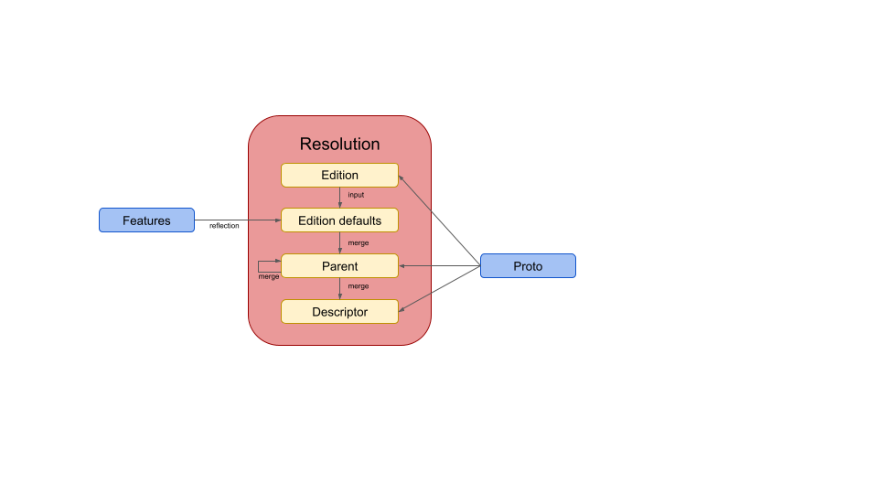
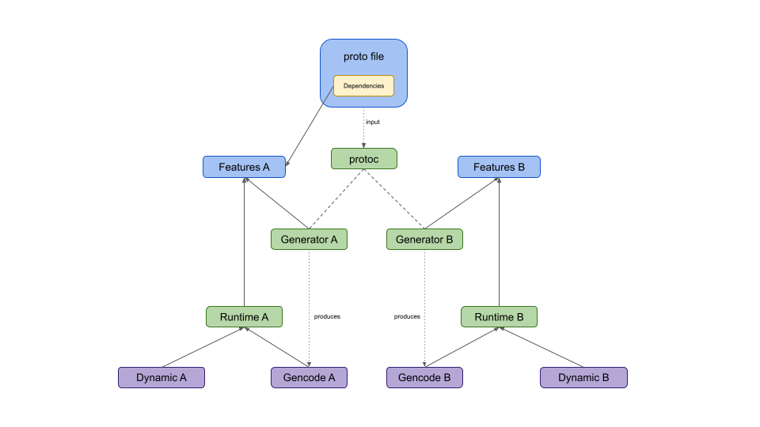
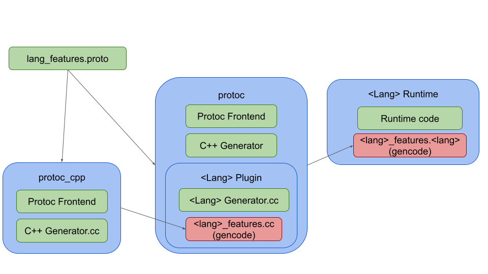

# Editions: Life of a FeatureSet

**Author:** [@mkruskal-google](https://github.com/mkruskal-google)

**Approved:** 2023-08-17

## Background

Outside of some minor spelling tweaks, our current implementation of features
has very closely followed the original design laid out in
[Protobuf Editions Design: Features](protobuf-editions-design-features.md). This
approach led to the creation of four different feature sets for each descriptor
though, and it's left under-specified who is responsible for generating these
(protoc, plugins, runtimes), who has access to them, and where they need to be
propagated to.

*Exposing Editions Feature Sets* (not available externally) was a first attempt
to try to define some of these concepts. It locks down feature visibility to
protoc, generators, and runtimes. Users will only be exposed to them indirectly,
via codegen changes or runtime helper functions, in order to avoid Hyrum's law
cementing every decision we make about them. We (incorrectly) assumed that the
protoc frontend would be able to calculate all the feature sets and then
propagate all four sets to the generators, who would then forward the fully
resolved runtime features to the runtime. This had the added benefit that we
could treat our C++ feature resolution logic as a source-of-truth and didn't
have to reimplement it identically in every language we support.

*Editions: Runtime Feature Set Defaults* (not available externally) was a
follow-up attempt to specifically handle the default feature sets of an edition.
We had realized that we would need proto2/proto3 default features in each
language to safely roll out editions, and that languages supporting descriptor
pools would have cases that bypass protoc entirely. The solution we arrived at
was that we should continue using the protoc frontend as the source-of-truth,
and propagate these defaults down to the necessary runtimes. This would fix the
proto2/proto3 issue, and at least provide some utilities to make the situation
easier for descriptor pool users.

[Protobuf Editions Design: Features](protobuf-editions-design-features.md)
defines the feature resolution algorithm, which can be summarized by the
following diagram:



Feature resolution for a given descriptor starts by using the proto file's
edition and the feature schemas to generate the default feature set. It then
merges all of the parent features from top to bottom, merging the descriptor's
features last.

## Glossary

We will be discussing features **a lot** in this document, but the meaning
behind the word can vary in some subtle ways depending on context. Whenever it's
ambiguous, we will stick to qualifying these according to the following
definitions:

*   **Global features** - The features contained directly in `FeatureSet` as
    fields. These apply to the protobuf language itself, rather than any
    particular runtime or generator.

*   **Generator features** - Extensions of `FeatureSet` owned by a specific
    runtime or generator.

*   **Feature resolution** - The process of applying the algorithm laid out in
    [Protobuf Editions Design: Features](protobuf-editions-design-features.md).
    This means that edition defaults, parent features, and overrides have all
    been merged together. After resolution, every feature should have an
    explicit value.

    *   **Unresolved features** - The features a user has explicitly set on
        their descriptors in the `.proto` file. These have not gone through
        feature resolution and are a minimal representation that require more
        knowledge to be useful.

    *   **Resolved features** - Features that have gone through feature
        resolution, with defaults and inheritance applied. These are the only
        feature sets that should be used to make decisions.

*   **Option Retention** - We support a retention specification on all options
    (see
    [here](https://protobuf.dev/programming-guides/proto3#option-retention)),
    including features

    *   **Source features** - The features available to protoc and generators,
        before option retention has been applied. These can be either resolved
        or unresolved.

    *   **Runtime features** - The features available to runtimes after option
        retention has been applied. These can be either resolved or unresolved.

## Problem Description

The flaw that all of these design documents suffer from is that protoc **can't**
be the universal source-of-truth for feature resolution under the original
design. For global features, there's of course no issue (protoc has a
bootstrapping setup for `descriptor.proto`` and always knows the global feature
set). For generator features though, we depend on [imports to make them
discoverable](protobuf-editions-design-features.md#specification-of-an-edition).

If a user is actually overriding one of these features, there will necessarily
be an import and therefore protoc will be able to discover generator features
and handle resolution. However, if the user is ok with the edition defaults
there's no need for an import. Without the import, protoc has **no way of
knowing** that those generator features exist in general. We could hardcode the
ones we own, but that just pushes the problem off to third-party plugins. We
could also force proto owners to include imports for *every* (transitive)
language they generate code to, even if they're unused, but that would be very
disruptive and isn't practical or idiomatic.

Pushing the source-of-truth to the generators makes things a little better,
since they each know exactly what feature file needs to be included. There's no
longer any knowledge gap, and we don't need to rely on imports to discover the
feature extension. Additionally, many of our generators are written in C++ (even
non-built-in plugins), so we could at least reuse our existing feature
resolution utility for all of those and limit the amount of duplication
necessary. However, there's still a code-size issue with this approach. As
described in the previous documents, we would need to send four feature sets for
**every** descriptor to the runtime (i.e. in the generator request and embedded
as a serialized string). We wouldn't be able to use inheritance or references to
minimize the cost, and every generator that embeds a `FileDescriptorProto` into
its gencode would see a massive code-size increase.

There's also still the issue of descriptor pools that need to be able to build
descriptors at runtime. These are typically power users (and our own unit-tests)
doing very atypical things and bypassing protoc entirely. In previous documents
we've attempted to push some of the cost onto them by explicitly not giving them
feature resolution. They would have to specify every feature on every
descriptor, and would not be able to use edition defaults or inheritance.
However, this cost is fairly high and it also makes the `edition` field
meaningless. Any missing feature would be a runtime error, and there would be no
concept of "edition". This creates an inconsistent experience for developers,
where they think in terms of editions in one context and then throw it out in
another. Also, it would mean that we have two distinct ways of specifying a
`FileDescriptorProto``: with unresolved features meant to only go through
protoc, and with fully resolved features meant to always bypass protoc.
Round-tripping descriptors would become difficult or impossible.

The following image attempts illustrates the issue:



Here, a proto file is used in both A and B runtimes. The schema itself only
overrides features for A though, and doesn't declare an import on B's features.
This means that protoc doesn't know about B's features, and Generator B will
need to resolve them. Additionally, dynamic messages in both A and B runtimes
have issues because they've bypassed protoc and don't have any way to follow the
feature resolution spec.

### Requirements

The following minimal feature sets are required by protoc:

*   **Resolved global source features** - to make proto-level decisions
*   **Unresolved global source features** - for validation

For each generator:

*   **Resolved generator source features** - to make language-specific codegen
    decisions
*   **Unresolved generator source features** - for validation
*   **Resolved global source features** - to make more complex decisions

For each runtime:

*   **All resolved runtime features** - for making runtime decisions
*   **All unresolved runtime features** - for round-trip behavior and debugging

With some additional requirements on an ideal solution:

*   **Minimal code-size costs** - code size bloat can easily block the rollout
    of editions, and once those limits are hit we don't have great solutions

*   **Minimal performance costs** - we want a solution that avoids any
    unnecessary CPU or RAM regressions

*   **Minimal code duplication** - obviously we want to minimize this, but where
    we can't, we need a suitable test strategy to keep the duplication in sync

*   **Runtime support for dynamic messages** - while dynamic messages are a
    less-frequently-used feature, they are a critical feature used by a lot of
    important systems. Our solution should avoid making them harder to use in
    any runtime that supports them.

## Recommended Solution

Our long-term recommendation here is to support and use feature resolution in
every stage in the life of a FeatureSet. Every runtime, generator, and protoc
itself will all handle feature resolution independently, only sharing unresolved
features between each other. This will necessarily mean duplication across
nearly every language we support, and the following sections will go into detail
about strategies for managing this.

The main justification for this duplication is the simple fact that *edition
defaults* will be needed almost everywhere. The generators need defaults for
*their* features to get fully resolved generator features to make decisions on,
and can't get them from protoc in every case. The runtimes need defaults for
both global and generator features in order to honor editions in dynamic
messages and to keep RAM costs down (e.g. the absence of feature overrides
should result in a reference to some shared default object). Since the
calculation of edition defaults is by far the most complicated piece of feature
resolution, with the remainder just being proto merges, it makes everything
simpler to understand if we just duplicate the entire algorithm.

#### Pros

*   Resolved feature sets will never be publicly exposed

    *   Our APIs will be significantly simpler, cutting the number of different
        types of feature sets by a factor of 2

    *   There will be no ambiguity about what a `FeatureSet` object *means*. It
        will always either be unresolved (outside of protobuf code) or fully
        resolved on all accessible features (inside protobuf code).

    *   RAM and code-size costs will be minimal, since we'll only be storing and
        propagating the minimal amount of information (unresolved features)

    *   Combats Hyrum's law by allowing us to provide wrappers around resolved
        features everywhere, instead of letting people depend on them directly

*   **Minimal** duplication on top of what's already necessary (edition
    defaults).

*   Dynamic messages will be treated on equal footing to proto files

*   The necessary feature dependencies will always be available in the
    appropriate context

*   We can simplify the current implementation since protoc won't need to handle
    resolution of imported features.

#### Cons

*   Requires duplication of feature resolution in every runtime and every unique
    generator language

    *   This means building out additional infrastructure to enforce
        cross-language conformance

### Runtimes Without Reflection

There are various runtimes that do not support reflection or dynamic messages at
all (e.g. Java lite, ObjC). They typically embed the "feature-like" information
they need directly into custom objects in the gencode. In these cases, the
problem becomes a lot simpler because they *don't need* the full FeatureSet
objects. We **don't** need to duplicate feature resolution in the runtime, and
the generator can just directly embed the fully resolved features values needed
by the runtime (of course, the generator might still need duplicate logic to get
those).

### Staged Rollout for Dynamic Messages

Long-term, we want to be able to handle feature resolution at run-time for any
runtime that supports reflection (and therefore needs FeatureSet objects) to
reduce code-size/RAM costs and support dynamic messages. However, in any
language where these costs are less critical, a staged rollout could be
appropriate. Here, the generator would embed the serialized resolved source
features into the gencode along with the rest of the options. We would use the
`raw_features` field (which should eventually be deleted) to also include the
unresolved features for reflection.

This would allow us to implement and test editions, and unblock the migration of
all non-dynamic cases. A follow-up optimization at a later stage could push this
down the runtime, and only embed unresolved features in the gencode.

Under this scenario, dynamic messages could still allow editions, as long as
fully-resolved features were provided on every descriptor. When we do implement
feature resolution, it will just be a matter of deleting redundant/unnecessary
features, but there should always be a valid transformation from fully-resolved
features to unresolved ones.

### C++ Generators

Generators written in C++ are in a better position since they don't require any
code duplication. They could be given visibility to our existing feature
resolution utility to resolve the features themselves. However, a better
alternative is to make improvements to this utility so that some helpers like
the ones we proposed in *Exposing Editions Feature Sets* can be used to access
the resolved features that *already exist*.

Protoc works by first parsing the input protofiles and building them into a
descriptor pool. This is the frontend pass, where only the global features are
needed. For built-in languages, the resulting descriptors are passed directly to
the generator for codegen. For plugins, they're serialized into descriptor
protos, rebuilt in a new descriptor pool (in the generator process), and then
sent to the generator code for codegen. In both of these cases, a
`DescriptorPool` build of the protos is done from a binary that *necessarily*
links in the relevant generator features.

Today, we discover features in the pool which are imported by the protos being
built. This has the hole we mentioned above where non-imported features can't be
discovered. Instead, we will pivot to a more explicit strategy for discovering
features. By default, `DescriptorPool` will only resolve the global features and
the C++ features (since this is the C++ runtime). A new method will be added to
`DescriptorPool` that allows new feature sets to replace the C++ features for
feature resolution. Generators will register their features via a virtual method
in `CodeGenerator` and the generator's pool build will take those into account
during feature resolution.

There are a few ways to actually define this registration, which we'll leave as
implementation details. Some examples that we're considering include:

*   Have the generator provide its own `DescriptorPool` containing the relevant
    feature sets
*   Have the generator provide a mapping of edition -> default `FeatureSet`
    objects

Expanding on previous designs, we will provide the following API to C++
generators via the `CodeGenerator` class:

They will have access to all the fully-resolved feature sets of any descriptor
for making codegen decisions, and they will have access to their own unresolved
generator features for validation. The `FileDescriptor::CopyTo` method will
continue to output unresolved runtime features, which will become unresolved
source features after option retention stripping (which generators should
already be doing), for embedding in the gencode for runtime use.

#### Example

As an example, let's look at some hypothetical language `lang` and how it would
introduce its own features. First, if it needs features at runtime it would
create a `lang_features.proto` file in its runtime directory and bootstrap the
gencode the same as it does for `descriptor.proto`. It would then *also*
bootstrap C++ gencode using a special C++-only build of protoc. This can be
illustrated in the following diagram:



This illustrates the bootstrapping setup for a built-in C++ generator. If
generator features weren't needed in the runtime, that red box would disappear.
If this were a separate plugin, the "plugin" box would simply be moved out of
`protoc` and `protoc` could also serve as `protoc_cpp`.

If `lang` didn't need runtime features, we would simply put the features proto
in the `lang` generator and only generate C++ code (using the same bootstrapping
technique as above).

After the generator registers `lang_features.proto` with the DescriptorPool, the
`FeatureSet` objects returned by `GetFeatures` will always have fully resolved
`lang` features.

### Non-C++ Generators

As we've shown above, non-C++ generators are already in a situation where they'd
need to duplicate *some* of the feature resolution logic. With this solution,
they'd need to duplicate much more of it. The `GeneratorRequest` from protoc
will provide the full set of *unresolved* features, which they will need to
resolve and apply retention stripping to.

**Note:** If we're able to implement bidirectional plugin communication, the
[Bidirectional Plugins](#bidirectional-plugins) alternative may be a simpler
solution for non-C++ generators that *don't* need features at runtime. Ones that
need it at runtime will need to reimplement feature resolution anyway, so it may
be less useful.

One of the trickier pieces of the resolution logic is the calculation of edition
defaults, which requires a lot of reflection. One of the ideas mentioned above
in [C++ Generators](#c++-generators) could actually be repurposed to avoid
duplication of this in non-C++ generators as well. The basic idea is that we
start by defining a proto:

```
message EditionFeatureDefaults {
  message FeatureDefaults {
    string edition = 1;
    FeatureSet defaults = 2;
  }
  repeated FeatureDefaults defaults = 1;
  string minimum_edition = 2;
  string maximum_edition = 3;
}
```

This can be filled from any feature set extension to provide a much more usable
specification of defaults. We can package a genrule that converts from feature
protos to a serialized `EditionFeatureDefaults` string, and embed this anywhere
we want. Both C++ and non-C++ generators/runtimes could embed this into their
code. Once this is known, feature resolution becomes a lot simpler. The hardest
part is creating a comparator for edition strings. After that, it's a simple
search for the lower bound in the defaults, followed by some proto merges.

### Bootstrapping

One major complication we're likely to hit revolves around our bootstrapping of
`descriptor.proto`. In languages that have dynamic messages, one codegen
strategy is to embed the `FileDescriptorProto` of the file and then parse and
build it at the beginning of runtime. For `descriptor.proto` in particular,
handling options can be very challenging. For example, in Python, we
intentionally strip all options from this file and then assume that the options
descriptors always exist during build (in the presence of serialized options).
Since features *are* options, this poses a challenge that's likely to vary
language by language.

We will likely need to special-case `descriptor.proto` in a number of ways.
Notably, this file will **never** have any generator feature overrides, since it
can't import those files. In every other case, we can safely assume that
generator features exist in a fully resolved feature set. But for
`descriptor.proto`, at least at the time it's first being built by the runtime,
this extension won't be present. We also can't figure out edition defaults at
that point since we don't have the generator features proto to reflect over.

One possible solution would be to codegen extra information specifically for
this bootstrapped proto, similar to what we suggested in *Editions: Runtime
Feature Set Defaults* for edition defaults. That would allow the generator to
provide enough information to build `descriptor.proto` during runtime. As long
as these special cases are limited to `descriptor.proto` though, it can be left
to a more isolated language-specific discussion.

### Conformance Testing

Code duplication means that we need a test strategy for making sure everyone
stays conformant. We will need to implement a conformance testing framework for
validating that all the different implementations of feature resolution agree.
Our current conformance tests provide a good model for accomplishing this, even
though they don't quite fit the problem (they're designed for
parsing/serialization). There's a runner binary that can be hooked up to another
binary built in any language. It sends a `ConformanceRequest` proto with a
serialized payload and set of instructions, and then receives a
`ConformanceResponse` with the result. In the runner, we just loop over a number
of fixed test suites to validate that the supplied binary is conformant.

We would want a similar setup here for language-agnostic testing. While we could
write a highly focused framework just for feature resolution, a more general
approach may set us up better in the future (e.g. option retention isn't
duplicated now but could have been implemented that way). This will allow us to
test any kind of transformation to descriptor protos, such as: proto3_optional,
group/DELIMITED, required/LEGACY_REQUIRED. The following request/response protos
describe the API:

```
message DescriptorConformanceRequest {
  // The file under test, pre-transformation.
  FileDescriptorProto file = 1;

  // The pool of dependencies and feature files required for build.
  FileDescriptorSet dependencies = 2;
}

message DescriptorConformanceResponse {
  // The transformed file.
  FileDescriptorProto file = 1;

  // Any additional features added during build.
  FileDescriptorSet added_features = 2;
}
```

Each test point would construct a proto file, its dependencies, and any feature
files to include in feature resolution. The conformance binary would use this to
fully decorate the proto file with resolved features, and send the result back
for comparison against our C++ source-of-truth. Any generator features added by
the binary will also need to be sent back to get matching results.

### Documentation

Because we're now asking third-party generator owners to handle feature
resolution on their own, we will need to document this. Specifically, we need to
open-source documentation for:

*   The algorithm described in
    [Protobuf Editions Design: Features](protobuf-editions-design-features.md)
*   The conformance test framework and how to use it (once it's implemented)

On the other hand, we will have significantly less documentation to write about
which feature sets to use where. Descriptor protos will *always* contain
unresolved features, and C++ generators will have a simple API for getting the
fully-resolved features.

## Considered Alternatives

### Use Generated Pool for C++ Generators

*Note: this was part of the original proposal, but has been refactored (see
cons)*

Generators written in C++ are in a better position since they don't require any
code duplication. They could be given visibility to our existing feature
resolution utility to resolve the features themselves. However, a better
alternative is to make improvements to this utility so that some helpers like
the ones we proposed in *Exposing Editions Feature Sets* can be used to access
the resolved features that *already exist*.

Protoc works by first parsing the input protofiles and building them into a
descriptor pool. This is the frontend pass, where only the global features are
needed. For built-in languages, the resulting descriptors are passed directly to
the generator for codegen. For plugins, they're serialized into descriptor
protos, rebuilt in a new descriptor pool (in the generator process), and then
sent to the generator code for codegen. In both of these cases, a
`DescriptorPool` build of the protos is done from a binary that *necessarily*
links in the relevant generator features.

However, the FeatureSets we supply to generators are transformed to the
generated pool (i.e. `FeatureSet` objects rather than `Message`) where the
generator features will always exist. We've decided that there's no longer any
reason to scrape the imports for features, but we *could* scrape the generated
pool for them. This essentially means that when you call `MergeFeatures` to get
a `FeatureSet`, the returned set is fully resolved *with respect to the current
generated pool*. This is a much clearer contract, and has the benefit that the
features visible to every C++ generator would automatically be populated with
the correct generator features for them to use.

Expanding on previous designs, we will provide the following API to C++
generators via the `CodeGenerator` class:

They will have access to all the fully-resolved feature set of any descriptor
for making codegen decisions, and they will have access to their own unresolved
generator features for validation. The `FileDescriptor::CopyTo` method will
continue to output unresolved runtime features, which will become unresolved
source features after option retention stripping (which generators should
already be doing), for embedding in the gencode for runtime use.

#### Pros

*   Automatic inclusion of any features used in a binary
*   Features will never be partially resolved

#### Cons

*   Implicit action at a distance could cause unexpected behaviors
*   Uses globals, making testing awkward
*   Not friendly to `DescriptorPool` cases who wouldn't necessarily want every
    linked-in feature to go through feature resolution.

### Default Placeholders

Protoc continues to propagate and resolve core features and imported language
level features. For language level features that protoc does not know about
(that is, not imported), a core placeholder feature indicating that the default
for a given edition should be respected can be propagated.

```
message FeatureSet {
  optional string unknown_feature_edition_default = N; // e.g. 2023
}
```

Instead of duplicating the entire feature resolution algorithm, plugins must
only provide a utility mapping editions to their default FeatureSet using the
generator feature files and optionally caching them.

For example:

```
if features.hasUtf8Validation():
  return features.getUtf8Validation()
else:
  default_features = getDefaultFeatures(features.getUnknownFeatureEditionDefault())
  return default_features.getUtf8Validation()
```

#### Pros

*   Less duplicate logic for propagating features

#### Cons

*   Descriptor proto bloat that is technically redundant with
    `FileDescriptorProto` edition.
*   Confusing that some but not all features are fully resolved
*   Duplicated logic to resolve edition default from edition #
*   Code-size and memory costs associated with the original approach still exist
*   Still doesn't help with the descriptor pool case, which may require
    duplicate logic.

### Bidirectional Plugins

Since the generators know the features they care about, we could have some kind
of bidirectional communication between protoc and the plugins. The plugin would
start by telling protoc the features it wants added, and then protoc would be
able to fully resolve all feature sets before sending them off. This has the
added benefit that it would allow us to do more interesting enhancements in the
future. For example, the plugin could send its minimum required edition and
other requirements *before* actually starting the build.

**Note:** Bidirectional plugins could still be implemented for other purposes.
This "alternative" is specifically for *using* that communication to pass
missing feature specs.

#### Pros

*   Eliminates code duplication problem
*   Provides infrastructure to enable future enhancements

#### Cons

*   Doesn't address the confusing API we have now where it's unclear what kind
    of features are contained in the `features` field
*   Doesn't address the code-size and memory costs during runtime
*   Doesn't address the descriptor pool case

### Central Feature Registry

Instead of relying on generators and imports to supply feature specs, we could
pivot to a central registry of all known features. Instead of simply claiming an
extension number, generator owners could be required to submit all the feature
protos to a central repository of feature protos. This would give protoc access
to **all** features. There would be two ways to implement this:

*   If it were built *into* protoc, we could avoid requiring any import
    statements. We would probably still want an extension point to avoid adding
    a dependency to `descriptor.proto`, but instead of `features.(pb.cpp)` they
    would be something more like `features.(pb).cpp`.

*   We could keep the current extension and import scheme. Proto files would
    still need to import the features they override, but protoc would depend on
    all of them and populate defaults for unspecified ones.

#### Pros

*   Makes all features easily discoverable wherever they're needed
*   Eliminates the code duplication problem
*   Gives us an option to remove the import statements, which are likely to
    cause future headaches (in the edition zero LSC, in maintenance afterward,
    and also for proto files that need to support a lot of third-party
    runtimes).

#### Cons

*   Doesn't address the code-size and memory costs
*   Creates version skew problems
*   Confusing ownership semantics

### Do Nothing

Doing nothing would basically mean abandoning editions. The current design
doesn't (and can't) work for third party generators. They'd be left to duplicate
the logic themselves with no guidance or support from us. We would also see
code-size and RAM bloat (except in C++) that would be very difficult to resolve.

#### Pros

*   Less work

#### Cons

*   Worse in every other way
