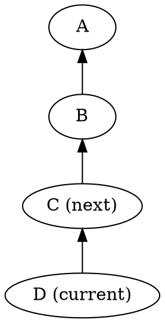
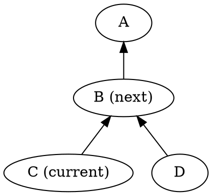
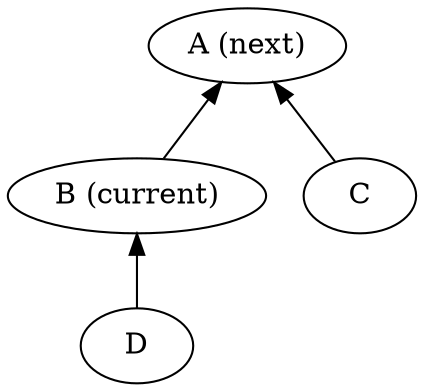
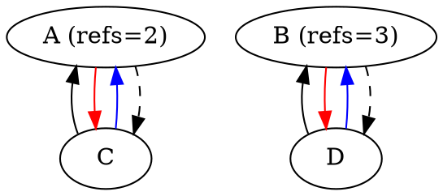
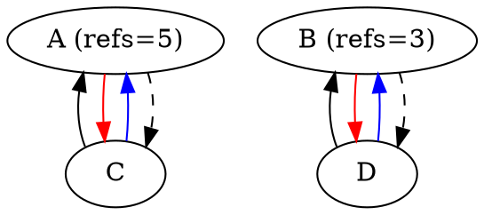
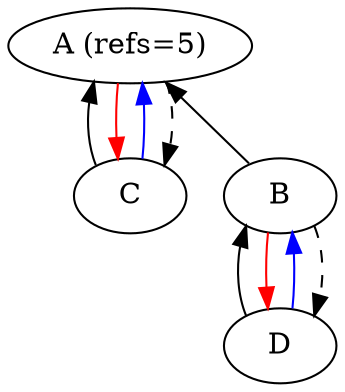
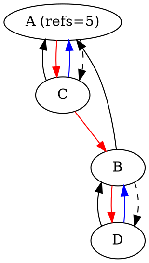
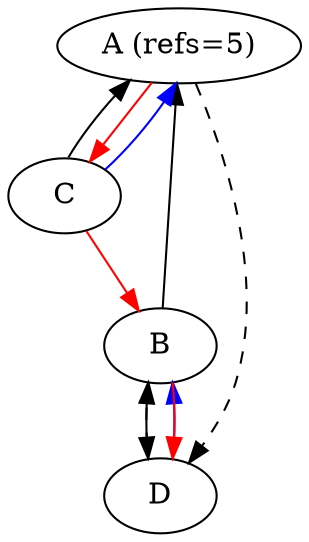
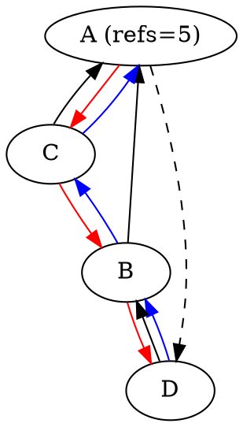

<!---
This document contains embedded graphviz diagrams inside ```dot blocks.

To convert it to rendered form using render.py:
  $ ./render.py wrapping-upb.in.md

You can also live-preview this document with all diagrams using Markdown Preview Enhanced
in Visual Studio Code:
  https://marketplace.visualstudio.com/items?itemName=shd101wyy.markdown-preview-enhanced
--->

# μpb Arena Fusion

μpb generally follows a thread-compatibility model where only operations on a
`const` pointer may occur concurrently from multiple threads; non-const
operations must not race with each other or operations on `const` pointers.

Fusion, via `upb_Arena_Fuse`, binds the lifetime of two arenas together, such
that none are freed until all of the transitively fused arenas reach refcount 0.
This is useful to avoid dangling pointers when a message in one arena references
a message in another - such as when a child message is constructed in isolation
then set onto a parent message - by fusing the parent's arena with the child's,
the child's lifetime is tied to the parent's without needing to copy it.

Both modifying the refcount and fusing are thread safe; if you want to
conceptually perform allocations concurrently from multiple threads with the
same arena lifetime, one way to achieve that would be to share a `const
upb_Arena* parent` plus a dedicated arena per thread, and fuse the
thread-specific arena with the `parent` arena. By contrast, reference counting
cannot help to achieve concurrent allocations on multiple threads, it only helps
in synchronizing lifetimes from multiple things observing the same arena (which
may be a non-`const` pointer for multiple writers in a single threaded context,
or a `const` pointer for multiple readers in a multithreaded context).

To be usable everywhere, it has a lock-free implementation, documented below.

## Data Structure

Each arena has three pointer sized members used to track the relationship
between arenas. Together, they implement a hybrid disjoint set forest and
doubly-linked list.

```c
// Tagged pointer - tracked as black arrows in diagrams
UPB_ATOMIC(uintptr_t) parent_or_count;
// Linked list - tracked as red arrows in diagrams
UPB_ATOMIC(struct upb_ArenaInternal*) next;
// Linked list - previous tracked as blue arrows in diagrams, tail as dashed
UPB_ATOMIC(uintptr_t) previous_or_tail;
```

The disjoint set is used to check whether two arenas are already fused and to
provide agreement on a single reference count across all fused arenas. The
linked list is used to implement freeing arenas once the refcount reaches 0, and
to implement `upb_Arena_SpaceAllocated`.

Two arenas are considered fused when the disjoint set says they are; the linked
list is guaranteed to converge before the refcount reaches 0, but may only track
a subset of fused arenas while racing with fuse calls.

## Finding the root

Each set of fused arenas is uniqiuely identified by the root node of its tree.
To find the root for a given arena, traverse the `parent_or_count` pointer until
you reach a node with a count instead of a parent pointer - that's the root. To
avoid expensive lookups if frequently repeated, this data structure uses path
splitting to halve the distance from the root for every node traversed.
Repeatedly finding the root for a series of nodes that are part of the same
fused set will converge to O(1) quickly. Let's find the root of D, starting
with:



We traverse our parents; each time we pass one we link it to its grandparent, so
that future lookups are faster.



Then:



D and C's paths got shorter; if we query D's root again, all subsequent lookups
will only require one step.

## Fusing

Fusing starts by identifying the roots of each arena to fuse - if they already
share a root, there's nothing to be done. We'll work through the example of
fusing C and D - which is the same as fusing A and B, as they're the roots.



A and B are roots, so they store a refcount in their `parent_or_count` and the
start of the linked list in their `next` pointers; C and D are not, so they
store pointers to their parent node in `parent_or_count`. C and D store `NULL`
in `next` as they happen to be the last nodes in their set.

### Pass refcount

As soon as the parent changes, all future refcount operations will switch to the
new root. To avoid decrementing to 0 while the old root still has active
references, we add the lower-addressed node's refcount to the new root.



The total transferred refcount is tracked throughout the operation so it can be
fixed up at the end if retries resulted in over-transfer.

### Union

Now the arena with a lower address becomes the new root (A in this case), by
compare-and-exchange the higher address arena's `parent_or_count` pointer.



This atomically eliminates B's refcount and makes it one of A's children. Any
change to B's refcount (or fusing it to a different arena with a lower address)
will make the swap fail, and the process starts again from the beginning.

### Refcount fixups

If B's refcount changed while performing the union, we increase or decrease A's
refcount by the difference between the initial refcount we added and B's final
refcount, observed as part of the compare-and-exchange of B's `parent_or_count`.

### Fuse linked lists

To fuse the linked lists, we need to make A's tail point to B. The root node is
always the start of the linked list, so that the list can't contain cycles. From
A's tail pointer, we traverse until we hit the end (C in this case), and CAS its
`next` to B.



With this, B is now reachable from the root and the final free operation will be
able to see it, traversing A->C->B->D.

### Update tail pointer

If we stopped at the previous step, it's easy to see how fusing many arenas
could result in O(n^2) behavior, as we'd spend all of our time traversing the
linked list from the root to find the tail. To avoid this, we update A's tail
pointer to point to B's tail - so the next fuse operation will not have to
traverse C or B.



### Update back links

To make it possible to always traverse the list in both directions for
`upb_Arena_SpaceAllocated`, we need to make the matching back link for our
doubly-linked list. Since we linked C to B, we need to link B to C via B's
`previous_or_tail` pointer.



## Counting allocated space

Traversing the linked list while the arenas are still live can be tricky, as we
can't necessarily reach our own node via the linked list from the root. Instead,
we scan the linked list in both directions starting from the caller-specified
node. This makes space counting weakly consistent - it's possible to see that A
and B are fused, but not see A's space reflected in `SpaceAllocated(B)` if the
fuse operation that joined them is still in progress. But counting allocated
space is always consistent with itself and any fully complete fuses - nodes are
only appended or prepended to the list, so starting the traversal at the same
point each time guarantees that future scans see a superset of previous ones.
