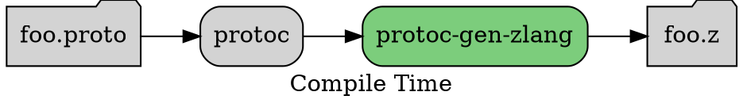
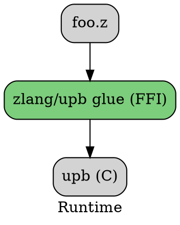
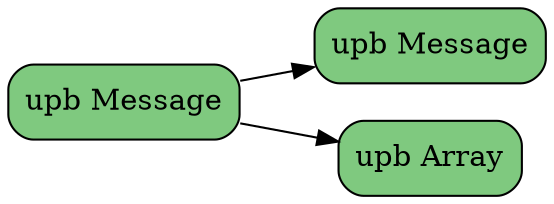
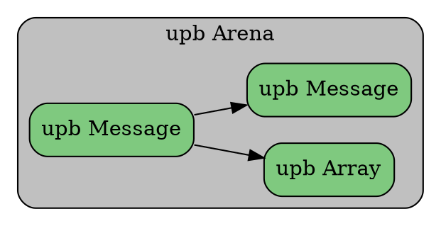
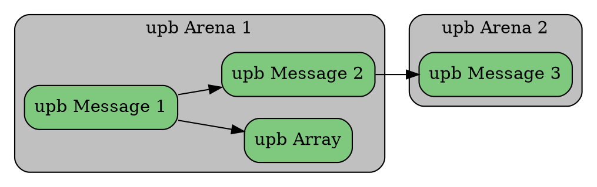
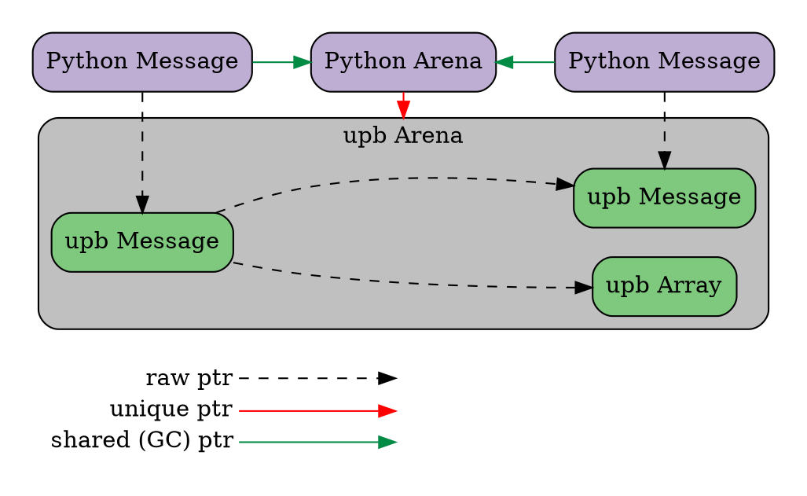

<!---
This document contains embedded graphviz diagrams inside ```dot blocks.

To convert it to rendered form using render.py:
  $ ./render.py wrapping-upb.in.md

You can also live-preview this document with all diagrams using Markdown Preview Enhanced
in Visual Studio Code:
  https://marketplace.visualstudio.com/items?itemName=shd101wyy.markdown-preview-enhanced
--->

# Building a protobuf library on upb

This is a guide for creating a new protobuf implementation based on upb.  It
starts from the beginning and walks you through the process, highlighting
some important design choices you will need to make.

## Overview

A protobuf implementation consists of two main pieces:

1. a code generator, run at compile time, to turn `.proto` files into source
   files in your language (we will call this "zlang", assuming an extension of ".z").
2. a runtime component, which implements the wire format and provides the data
   structures for representing protobuf data and metadata.

<br/>



<br/>



The parts in green are what you will need to implement.

Note that your code generator (`protoc-gen-zlang`) does *not* need to generate
any C code (eg. `foo.c`). While upb itself is written in C, upb's parsers and
serializers are fully table-driven, which means there is never any need or even
benefit to generating C code for each proto. upb is capable of full-speed
parsing even when schema data is loaded at runtime from strings embedded into
`foo.z`. This is a key benefit of upb compared with C++ protos, which have
traditionally relied on generated parsers in `foo.pb.cc` files to achieve full
parsing speed, and suffered a ~10x speed penalty in the parser when the schema
data was loaded at runtime.

## Prerequisites

There are a few things that the language runtime must provide in order to wrap
upb.

1.  **FFI**: To wrap upb, your language must be able to call into a C API
    through a Foreign Function Interface (FFI). Most languages support FFI in
    some form, either through "native extensions" (in which you write some C
    code to implement new methods in your language) or through a direct FFI (in
    which you can call into regular C functions directly from your language
    using a special library).
2.  **Finalizers, Destructors, or Cleaners**: The runtime must provide
    finalizers or destructors of some sort. There must be a way of triggering a
    call to a C function when the language garbage collects or otherwise
    destroys an object. We don't care much whether it is a finalizer, a
    destructor, or a cleaner, as long as it gets called eventually when the
    object is destroyed. upb allocates memory in C space, and a finalizer is our
    only way of making sure that memory is freed and does not leak.
3.  **HashMap with weak values**: (optional) This is not a strong requirement,
    but it is sometimes helpful to have a global hashmap with weak values to act
    as a `upb_msg* -> wrapper` object cache. We want the values to be weak (not
    the keys). There is some question about whether we want to continue to use
    this pattern going forward.

## Reflection vs. MiniTables

The first key design decision you will need to make is whether your generated
code will access message data via reflection or minitables. Generally more
dynamic languages will want to use reflection and more static languages will
want to use minitables.

### Reflection

Reflection-based data access makes the most sense in highly dynamic language
interpreters, where method dispatch is generally resolved via strings and hash
table lookups.  

In such languages, you can often implement a special method like `__getattr__`
(Python) or `method_missing` (Ruby) that receives the method name as a string.
Using upb's reflection, you can look up a field name using the method name,
thereby using a hash table belonging to upb instead of one provided by the
language.

```python
class FooMessage:
  # Written in Python for illustration, but in practice we will want to
  # implement this in C for speed.
  def __getattr__(self, name):
    field = FooMessage.descriptor.fields_by_name[name]
    return field.get_value(self)
```

Using this design, we only need to attach a single `__getattr__` method to each
message class, instead of defining a getter/setter for each field. In this way
we can avoid duplicating hash tables between upb and the language interpreter,
reducing memory usage.

Reflection-based access requires loading full reflection at runtime. Your
generated code will need to embed serialized descriptors (ie. a serialized
message of `descriptor.proto`), which has some amount of size overhead and
exposes all message/field names to the binary. It also forces a hash table
lookup in the critical path of field access. If method calls in your language
already have this overhead, then this is no added burden, but for statically
dispatched languages it would cause extra overhead.

If we take this path to its logical conclusion, all class creation can be
performed fully dynamically, using only a binary descriptor as input. The
"generated code" becomes little more than an embedded descriptor plus a
library call to load it. Python has recently gone down this path. Generated
code now looks something like this:

```python
# main_pb2.py
from google3.net.proto2.python.internal import builder as _builder
from google3.net.proto2.python.public import descriptor_pool as _descriptor_pool

DESCRIPTOR = _descriptor_pool.Default().AddSerializedFile("<...>")
_builder.BuildMessageAndEnumDescriptors(DESCRIPTOR, globals())
_builder.BuildTopDescriptorsAndMessages(DESCRIPTOR, 'google3.main_pb2', globals())
```

This is all the runtime needs to create all of the classes for messages defined
in that serialized descriptor.  This code has no pretense of readability, but
a separate `.pyi` stub file provides a fully expanded and readable list of all
methods a user can expect to be available:

```python
# main_pb2.pyi
from google3.net.proto2.python.public import descriptor as _descriptor
from google3.net.proto2.python.public import message as _message
from typing import ClassVar as _ClassVar, Optional as _Optional

DESCRIPTOR: _descriptor.FileDescriptor

class MyMessage(_message.Message):
    __slots__ = ["my_field"]
    MY_FIELD_FIELD_NUMBER: _ClassVar[int]
    my_field: str
    def __init__(self, my_field: _Optional[str] = ...) -> None: ...
```

To use reflection-based access:

1. Load and access descriptor data using the interfaces in upb/def.h.
2. Access message data using the interfaces in upb/reflection.h.

### MiniTables

MiniTables are a "lite" schema representation that are much smaller than
reflection. MiniTables omit names, options, and almost everything else from the
`.proto` file, retaining only enough information to parse and serialize binary
format.

MiniTables can be loaded into upb through *MiniDescriptors*. MiniDescriptors are
a byte-oriented format that can be embedded into your generated code and passed
to upb to construct MiniTables. MiniDescriptors only use printable characters,
and therefore do not require escaping when embedding them into generated code
strings. Overall the size savings of MiniDescriptors are ~60x compared with
regular descriptors.

MiniTables and MiniDescriptors are a natural choice for compiled languages that
resolve method calls at compile time. For languages that are sometimes compiled
and sometimes interpreted, there might not be an obvious choice. When a method
call is statically bound, we want to remove as much overhead as possible,
especially from accessors. In the extreme case, we can use unsafe APIs to read
raw memory at a known offset:

```java
// Example of a maximally-optimized generated accessor.
class FooMessage {
    public long getBarField() {
        // Using Unsafe should give us performance that is comparable to a
        // native member access.
        //
        // The constant "24" is obtained from upb at compile time.
        sun.misc.Unsafe.getLong(this.ptr, 24);
    }
}
```

This design is very low-level, and tightly couples the generated code to one
specific version of the schema and compiler.  A slower but safer version would
look up a field by field number:

```java
// Example of a more loosely-coupled accessor.
class FooMessage {
    public long getBarField() {
        // The constant "2" is the field number.  Internally this will look
        // up the number "2" in the MiniTable and use that to read the value
        // from the message.
        upb.glue.getLong(this.ptr, 2);
    }
}
```

One downside of MiniTables is that they cannot support parsing or serializing
to JSON or TextFormat, because they do not know the field names.  It should be
possible to generate reflection data "on the side", into separate generated
code files, so that reflection is only pulled in if it is being used.  However
APIs to do this do not exist yet.

To use MiniTable-based access:

1. Load and access MiniDescriptors data using the interfaces in upb/mini_table.h.
2. Access message data using the interfaces in upb/message/accessors.h.

## Memory Management

One of the core design challenges when wrapping upb is memory management.  Every
language runtime will have some memory management system, whether it is
garbage collection, reference counting, manual memory management, or some hybrid
of these.  upb is written in C and uses arenas for memory management, but upb is
designed to integrate with a wide variety of memory management schemes, and it
provides a number of tools for making this integration as smooth as possible.

### Arenas

upb defines data structures in C to represent messages, arrays (repeated
fields), and maps.  A protobuf message is a hierarchical tree of these objects.
For example, a relatively simple protobuf tree might look something like this:



All upb objects are allocated from an arena.  An arena lets you allocate objects
individually, but you cannot free individual objects; you can only free the arena
as a whole.  When the arena is freed, all of the individual objects allocated
from that arena are freed together.



In simple cases, the entire tree of objects will all live in a single arena.
This has the nice property that there cannot be any dangling pointers between
objects, since all objects are freed at the same time.

However upb allows you to create links between any two objects, whether or
not they are in the same arena.  The library does not know or care what arenas
the objects are in when you create links between them.



When objects are on separate arenas, it is the user's responsibility to ensure
that there are no dangling pointers.  In the example above, this means Arena 2
must outlive Message 1 and Message 2.

### Integrating GC with upb

In languages with automatic memory management, the goal is to handle all of the
arenas behind the scenes, so that the user does not have to manage them manually
or even know that they exist.

We can achieve this goal if we set up the object graph in a particular way.  The
general strategy is to create wrapper objects around all of the C objects,
including the arena.  Our key goal is to make sure the arena wrapper is not
GC'd until all of the C objects in that arena have become unreachable.

For this example, we will assume we are wrapping upb in Python:



In this example we have three different kinds of pointers:

* **raw ptr**: This is a pointer that carries no ownership.
* **unique ptr**: This is a pointer has *unique ownership* of the target.  The owner
  will free the target in its destructor (or finalizer, or cleaner).  There can
  only be a single unique pointer to a given object.
* **shared (GC) ptr**: This is a pointer that has *shared ownership* of the
  target.  Many objects can point to the target, and the target will be deleted
  only when all such references are gone.  In a runtime with automatic memory
  management (GC), this is a reference that participates in GC.  In Python such
  references use reference counting, but in other VMs they may use mark and
  sweep or some other form of GC instead.

The Python Message wrappers have only raw pointers to the underlying message,
but they contain a shared pointer to the arena that will ensure that the raw
pointer remains valid.  Only when all message wrapper objects are destroyed
will the Python Arena become unreachable, and the upb arena ultimately freed.

### Links between arenas with "Fuse"

The design given above works well for objects that live in a single arena. But
what if a user wants to create a link between two objects in different arenas?

TODO

## UTF-8 vs. UTF-16

TODO

## Object Cache

TODO
